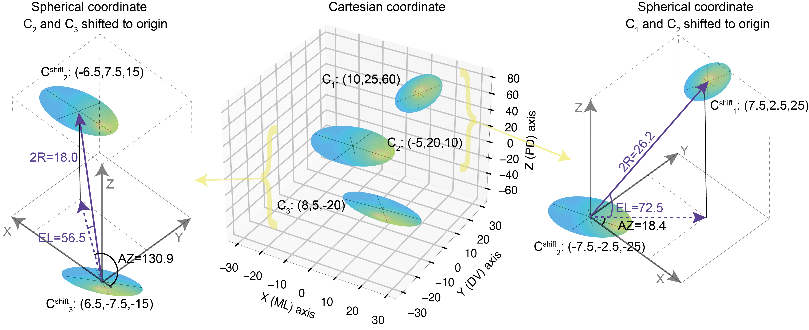

# Clonal analysis in embryonic and postnatal growth plates 

I utilized these scripts to analyze the clonal lineage clusters within the growth plate tissue of E18.5 and postnatal P40 mice (specifically, the distal femur and proximal tibia) that were administered tamoxifen via gavage at E14.5 and P30, respectively, in confetti mice.

These scripts process input data derived from clone masks and nuclei-labeled morphology to discern the organization of nuclei within the clones. It was previously hypothesized that proliferative chondrocytes formed a columnar arrangement crucial for bone elongation.

For the first time, we employed 3D labeling of nuclei to analyze these clones. To achieve this, we used the elevation angle in a spherical coordinate system to measure the angle between two consecutive nuclei, thereby defining the topology of the proliferative chondrocytes. An elevation angle of 90 degrees indicates that the two nuclei are perfectly aligned in a columnar arrangement, parallel to the elongation of the growth plate. Conversely, an angle of 0 degrees signifies that the two neighboring nuclei are perpendicular to the long axis of the bones, contributing to circumferential growth.

Additionally, these scripts generate random clones from unlabeled nuclei for comparison with genuine embryonic labeled chondrocyte clones. Criteria for generating random clones include containing the same number of nuclei, approximately the same height within the growth plate, and forming a single connected component.

We also generate spatial profiles along the resting zone to the hypertrophic zone of the growth plate in the X-axis, measuring various properties along the Y-axis. These properties encompass clone size, sphericity, angle between the principal component 1 (PC1) of the clone and the long axis of the bone, radius of gyration, volume, clone density, surface area, volume fraction, column height, allometric properties (ratio of volume^(2/3) to surface area), average degree (or coordination number) of the clone, principal components PC1/2/3 of the clones, ratios of PC2/PC1, PC3/PC1, and PC3/PC2, as well as local/global order parameters.

These scripts are self-explanatory, with each task organized into separate folders. If you wish to execute these scripts, kindly use them and cite our manuscript. For assistance in running these scripts, please do not hesitate to contact me via email [ankitplusplus[@]gmail.com]

Reference: Sarah Rubin, Ankit Agrawal, Anne Seewald, Paul Villoutreix, Adrian Baule, Elazar Zelzer
"Bone elongation in the embryo occurs without column formation in the growth plate" (BioRxiv 2023)
(doi: https://doi.org/10.1101/2023.11.14.567062)
